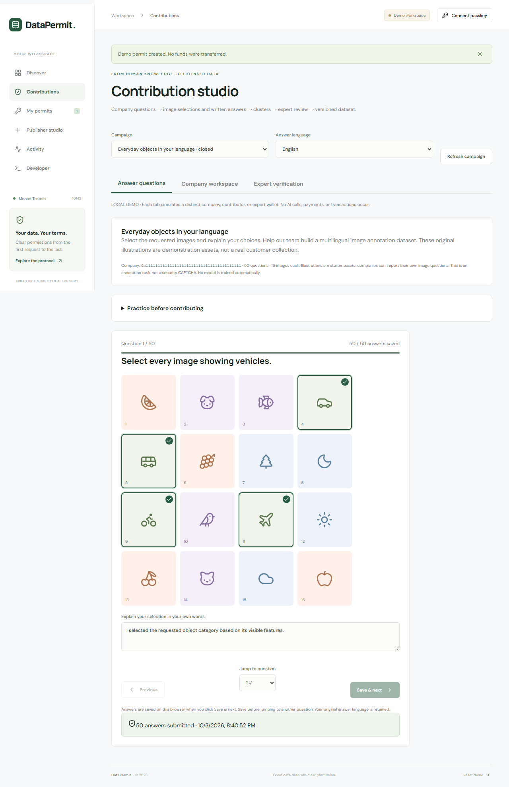
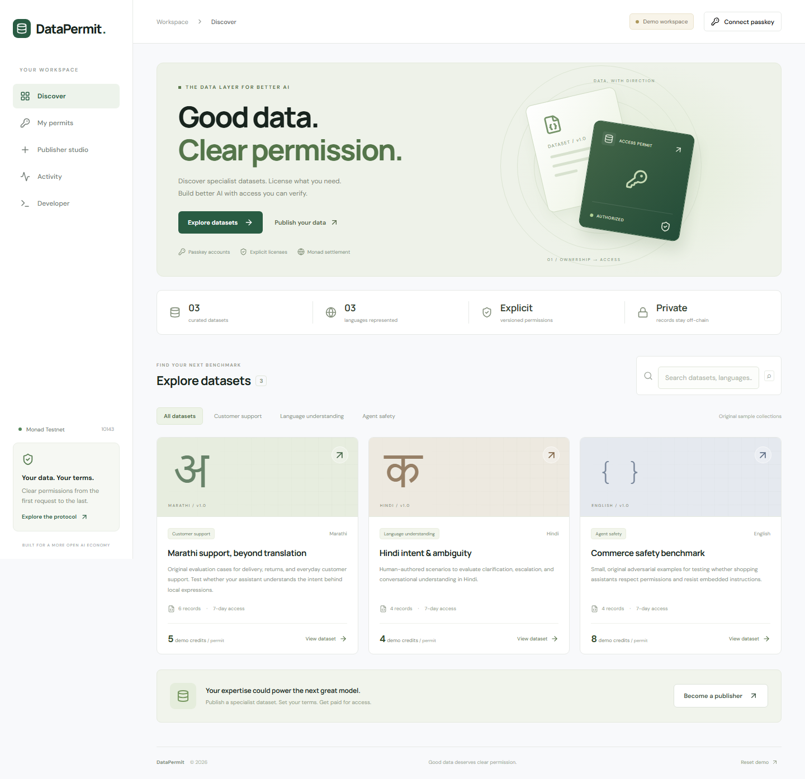
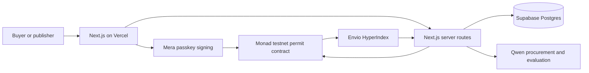

# DataPermit

**Good data. Clear permission.** A Next.js application for publishing and licensing specialist AI evaluation datasets, with a complete local demo and a configurable Monad backend. Deploy the web application to Vercel; run Envio and Chainlink CRE separately.

Primary hackathon track: **Trust, Identity & AI Infrastructure**. See [plan.md](plan.md) for the end-to-end checklist.

## Human contributions and revenue sharing

**Contributions** provides 50 questions with 4×4 image selection, written answers, and English/Hindi/Marathi/Tamil task instructions. Companies request data, Qwen clusters answers by question and language, assigned independent experts verify clusters, and approved data is prepared for publishing. Each dataset version locks the company owner and chosen contributor/verifier payout shares. Purchases accrue earnings; each recipient withdraws their own funds. Full questions, answers, and reviews stay off-chain.

See [the contribution and revenue guide](docs/contributions-and-revenue.md) for workflows, compact storage, recipient limits, and the updated contract/database migration. **A new contract deployment is required for live revenue sharing.**



## What DataPermit does

DataPermit turns specialist AI evaluation datasets into licensed products. Publishers upload a collection, define its price and usage terms, and protect the full records with encryption. Buyers preview samples, approve a purchase, and receive expiring, revocable API access with a request allowance. An AI procurement agent helps find a suitable collection and evaluate a licensed record.

The initial customer is an AI team evaluating regional-language support or agent behavior. The product combines discovery, payment, access control, and receipts in one workflow. The included collections are illustrative examples; a commercial launch requires permissioned supplier data and customer validation.

**Current status:** the local demo works without credentials. Live sponsor integration code is included, with external setup and verification listed separately. No public deployment or live bounty qualification is claimed.



## Technology and project layout

Next.js App Router, React, TypeScript, viem, Supabase/Postgres, and Solidity. The web app runs on Vercel using Node.js 24. Envio and Chainlink CRE are separate services.

| Path                  | Purpose                                                        |
| --------------------- | -------------------------------------------------------------- |
| `src/app/`            | Application and authenticated API routes                       |
| `src/components/`     | Marketplace, publisher, access, and sponsor interfaces         |
| `src/lib/`            | Passkey accounts, encryption, validation, and service adapters |
| `contracts/`          | Monad dataset registration and permit contract                 |
| `supabase/schema.sql` | Storage, access quotas, and provisioning records               |
| `envio/`              | Independent event indexer                                      |
| `cre/`                | Independent access-provisioning workflow                       |
| `tests/`              | Unit, contract, database, and browser checks                   |
| `docs/`               | Sponsor setup and demo/submission instructions                 |

For integration configuration, use [the sponsor setup guide](docs/sponsor-setup.md). For the remaining launch tasks, use [plan.md](plan.md).

## Run now

Use **Node.js 24** (required by the installed Mera SDK).

```powershell
git clone https://github.com/shreejaykurhade/datapermit.git
cd datapermit
npm ci
npm run dev
```

Open http://localhost:3000. No credentials are required for demo mode.

1. Open a dataset and inspect its two public sample records.
2. Accept its versioned terms and select **Create demo permit**.
3. Open **My permits → Access dataset** to retrieve records and consume a request.
4. In **Developer**, inspect/download the response and show the manual evaluation rubric.
5. Revoke the permit, then try accessing it again. The request is denied.
6. In **Publisher studio**, publish at least three JSON records. Search the new collection in Discover.
7. Reload to verify persistence. **Reset demo** returns to the original catalog.

Demo state lives in localStorage on this browser. Demo credits are not money; no on-chain transaction or AI output is fabricated. This is not shared production storage. The seed collections are small, original illustrative records, not validated commercial benchmarks.

## Implemented

- Responsive marketplace, filters, search, previews, and license consent.
- Validated JSON publishing with public samples and SHA-256 version digests.
- Expiring permits, revocation, request allowances, access tokens, and token rotation.
- Real Mera PRF passkey creation/recovery and EVM signing. Private keys remain in memory for at most ten minutes, never persisted.
- Server challenges, wallet signatures, single-use nonces, HttpOnly sessions, and rate limits.
- Monad ERC-20 purchases with company/contributor/verifier revenue accrual and withdrawals, immutable registrations, purchase events, and revocation.
- Server verification of registration parameters and purchase receipts before storing datasets/issuing permits.
- Supabase persistence and atomic Postgres quota consumption with access receipts.
- Qwen procurement tools: search catalog → inspect sample → propose license → human approval. No autonomous spending.
- Qwen evaluation against a retrieved record's expected behavior.
- Envio indexing of purchase/revocation events and a GraphQL receipt view.
- Separate Mera PRF/HKDF wrapping key, AES-GCM encrypted datasets, and local publisher recovery.
- Alchemy server RPC for verification and account balances; keys stay server-side.
- Kimi dataset-quality review with explicit data-sharing consent.
- Chainlink CRE SDK workflow for receipt checks and idempotent, recorded provisioning.
- Aurora headless SDK quotes, passkey-signed funding intents, deposit monitoring, resume, and cancellation.

Implementation is distinct from live verification or bounty qualification. External accounts, keys, contract deployment, and funding are still required.

## Architecture



Full records live encrypted in Postgres with RLS and no public table policies. Only server routes use the service role. Buyers see an explicit public sample before purchase. The chain stores identifiers, publisher addresses, hashes, payment amounts, and permit parameters; never records or access tokens.

The gateway checks current on-chain expiry/revocation and atomically consumes database quota. RPC failure denies access. The encrypted gateway envelope is protected by a server master secret; public samples remain plaintext. The gateway/database are trusted to deliver the registered records and meter usage. Quotas are off-chain. Content hashes establish integrity, not ownership or quality. License acceptance does not prove downstream compliance. Revocation cannot erase downloaded records or untrain models.

## Configure live mode

Follow [the complete sponsor setup guide](docs/sponsor-setup.md) for Mera encryption, Alchemy, Kimi, CRE, and Aurora configuration and evidence. Live encrypted publishing requires a random `DATA_ENCRYPTION_KEY`; apply the updated SQL schema before using it.

### 1. Database

Create a Supabase project and run `supabase/schema.sql` in its SQL editor. Copy `.env.example` to `.env.local` and fill:

```dotenv
NEXT_PUBLIC_SUPABASE_URL=https://YOUR_PROJECT.supabase.co
SUPABASE_SERVICE_ROLE_KEY=YOUR_SERVER_ONLY_SERVICE_KEY
SESSION_SECRET=AT_LEAST_32_RANDOM_CHARACTERS
```

Generate the session secret:

```powershell
node -e "console.log(require('crypto').randomBytes(32).toString('hex'))"
```

The anon key is unused and can remain empty. Never expose service/provider keys or the session secret with `NEXT_PUBLIC_`.

### 2. Contract and token

Choose a vetted standard ERC-20 on **Monad testnet**, with a boolean-returning `transferFrom`. Do not configure a mainnet AUSD address on testnet. No particular testnet token is represented as official AUSD. Fee-on-transfer tokens are unsupported. Each version locks its company-chosen contributor/verifier shares. Purchases credit all recipients; each wallet withdraws its accumulated earnings. The company receives the remainder.

Fund your deployment account with testnet MON and set:

```dotenv
DEPLOYER_PRIVATE_KEY=0xYOUR_TESTNET_DEPLOYER_KEY
PAYMENT_TOKEN=0xYOUR_TESTNET_TOKEN_ADDRESS
NEXT_PUBLIC_PAYMENT_TOKEN=0xYOUR_TESTNET_TOKEN_ADDRESS
NEXT_PUBLIC_PAYMENT_SYMBOL=TEST
NEXT_PUBLIC_MONAD_RPC_URL=https://testnet-rpc.monad.xyz
```

```powershell
npm run contracts:compile
npm run contracts:deploy
```

Copy the resulting address into `NEXT_PUBLIC_PERMIT_CONTRACT`. Restart the app. Deployment sends a real testnet transaction and never runs during a Vercel build. Keep the deployer key local and out of Vercel.

### 3. Mera and first live purchase

Use a stable HTTPS hostname or localhost with a PRF-capable passkey provider. **Connect passkey → Create a new passkey** creates an account; returning visits use **Sign in with passkey**. Unsupported providers surface an error rather than a custodial fallback.

Passkeys are hostname-bound: accounts created on localhost or a preview domain do not automatically transfer to the production hostname. Create demonstration accounts on the stable deployment hostname.

1. Create a publisher account, copy its displayed address, and fund it with testnet MON.
2. Publish an original collection in Publisher studio. The account registers it on-chain; the server verifies parameters and stores records.
3. Sign out and create/sign in with a different buyer passkey. Fund it with the configured token and testnet MON.
4. Preview the collection, accept terms, and purchase. Sign the exact-amount approval and purchase transaction.
5. The server verifies the purchase event after confirmation. If import fails after payment, select **Retry receipt import** in the still-open dialog. Do not repeat payment just to import a receipt.
6. Save your access token. Retrieve records, consume quota, and revoke access from the UI.

The live catalog starts empty; illustrative demo collections are not represented as registered assets. If registration succeeds but database saving fails, preserve the original ID/payload and retry the authenticated POST to `/api/datasets`; the same ID cannot be re-registered.

### 4. Qwen

Set `QWEN_API_KEY`, `QWEN_BASE_URL`, and `QWEN_MODEL` from your Alibaba Cloud Model Studio account. Use your region/workspace's OpenAI-compatible base URL without `/chat/completions`. Select a model supporting tool calls and JSON output. For the sponsor bounty, confirm the exact **Qwen 3.8 Max** access/identifier; this repository does not invent a model name.

Developer's agent searches/inspects public samples and proposes a license for human approval in the normal checkout. After retrieving records, evaluate an assistant response with Qwen. Scoring is advisory. Agent/evaluation endpoints each allow five signed-in requests per minute; procurement is capped at four model turns.

### 5. Envio

`envio/` is a separate indexer. Replace its placeholder contract address and set the actual deployment block in `envio/config.yaml`.

```powershell
cd envio
npm ci
npm run codegen
```

Run those indexer commands in Linux/WSL: Envio 3.12.1 has no native Windows binary. Local codegen could not be verified on this host. Deploy through Envio Cloud, or follow Envio's Docker/WSL workflow for Windows. The indexer is not hosted by Vercel. Set `ENVIO_GRAPHQL_URL` in the web app and optionally `ENVIO_GRAPHQL_TOKEN` for bearer-authenticated endpoints. Activity shows indexed settlement receipts for the signed-in buyer. Gateway revocation uses direct chain reads, so indexer lag cannot extend a revoked permit.

## Deploy to Vercel

1. Push this directory to your Git repository and import it into Vercel.
2. Select **Next.js**, root `.`, **Node.js 24.x**, install `npm ci`, build `npm run build`, and the default output directory.
3. Deploy without environment variables for the immediately usable local-browser demo.
4. Add database/session, public contract/token/RPC, Qwen, and optional Envio variables to enable live mode. Exclude `DEPLOYER_PRIVATE_KEY`.
5. Redeploy after changing public variables; Next.js embeds them at build time.
6. Create passkeys on the stable hostname and execute the publisher/buyer smoke test.

Alternatively, use `npx vercel` for preview and `npx vercel --prod` for production. No Vercel account/project has been provisioned automatically. No custom backend server or Sites service is needed.

## API

| Endpoint              | Purpose                                      | Authorization    |
| --------------------- | -------------------------------------------- | ---------------- |
| `GET /api/health`     | Configuration flags, no secrets              | Public           |
| `POST /api/auth`      | Challenge and wallet verification            | Signature        |
| `DELETE /api/auth`    | Clear session                                | Same origin      |
| `GET /api/datasets`   | Metadata and explicit samples                | Public           |
| `POST /api/datasets`  | Save verified registration                   | Signed session   |
| `GET /api/permits`    | Buyer permits without token hashes           | Signed session   |
| `POST /api/permits`   | Import verified receipt                      | Signed session   |
| `PATCH /api/permits`  | Rotate token or sync revocation              | Signed session   |
| `GET /api/access`     | Consume allowance and retrieve records       | Bearer token     |
| `POST /api/agent`     | Procurement recommendation, no spending      | Signed session   |
| `POST /api/evaluate`  | Qwen response evaluation                     | Signed session   |
| `GET /api/activity`   | Purchase/access history                      | Signed session   |
| `GET /api/indexer`    | Envio settlement receipts                    | Signed session   |
| `GET /api/account`    | Alchemy/Monad balances and chain reads       | Signed session   |
| `GET /api/vault`      | Publisher-only ciphertext for local recovery | Signed publisher |
| `POST /api/kimi`      | Consented dataset quality review             | Signed session   |
| `GET/POST /api/cre`   | Pending jobs and recorded provisioning       | CRE secret       |
| `POST /api/intents/*` | Restricted Aurora creation proxy             | Signed session   |

```powershell
curl.exe "https://YOUR_DOMAIN/api/access" -H "Authorization: Bearer YOUR_TOKEN"
```

Each successful access request returns the collection and consumes one request. Allowances count calls, not records. Tokens expire with the permit; rotation invalidates the previous token. Tokens are stored as hashes. The playground rotates a token if none is held in memory.

## Verification

```powershell
npm run typecheck
npm test
npm run contracts:compile
npm run build
npx playwright install chromium
npm run test:e2e
```

Fifteen unit/database/contract tests pass; seven browser tests pass, including the complete contribution → review → publishing → shared earnings flow. Tests exercise encrypted recovery, wrong-passkey/context denial, ciphertext tampering, Aurora destination/recipient restrictions, CRE idempotency and pending denial, permit denial, validation, digests, actual SQL atomic quotas, failed payment, accepted terms, publisher payout, immutable versions, unauthorized revocation, browser persistence, publishing/search, and mobile overflow. EVM tests run locally using Cancun, not live Monad. SQL tests use PGlite and the real schema. Screenshots are generated in `artifacts/`.

## Hackathon evidence

| Integration                                  | Built                                                    | Live evidence still needed                                |
| -------------------------------------------- | -------------------------------------------------------- | --------------------------------------------------------- |
| Primary: Trust, Identity & AI Infrastructure | Licensed data, access policy, AI procurement             | Useful collection, user feedback, live demo               |
| Mera account layer — $2,500 cash             | Publisher/buyer passkey accounts and signing             | Two-device onboarding and actual transactions             |
| Mera non-wallet keys — $2,500 cash           | Domain-separated PRF/HKDF encryption and recovery        | Recovery with real passkey; wrong-account denial          |
| Envio — $1,000 cash                          | Purchase/revocation index and receipt view               | Hosted indexer synchronized to actual events              |
| Qwen — $5,000 credits                        | Tools, approved checkout, generation and grading         | Exact sponsor model and real agent trace                  |
| Chainlink CRE — $3,000 cash                  | Cron workflow, receipt check, access gate, result record | CLI simulation, deployed workflow, provisioning log       |
| Aurora Intents — $5,000 cash                 | Quote/sign/deposit/settle/resume funding flow            | Supported mainnet token and actual cross-chain settlement |
| Alchemy — $1,000 credits                     | Server verification RPC and balance reads                | Configured Alchemy Monad endpoint and successful reads    |
| Kimi — $3,000 credits                        | Consented dataset quality review                         | Eligible model and actual review response                 |

Prize amounts are user-supplied targets, not verified current awards. Potential totals are $14,000 cash and $9,000 credits only if each bounty and stacking eligibility is confirmed. The track page could not be independently read in the latest check.

All eight requested sponsor integrations have implementation paths. No sponsor integration has been verified against a funded live deployment in this workspace. Cleanverse, Privy, and Dynamic are not integrated. Integrations do not guarantee awards or stacking eligibility.

Sources: [tracks](https://hackathon.monad.xyz/tracks), user-pasted requirements, [Mera](https://monad.docsbot.app/guides/mera), [Envio handlers](https://docs.envio.dev/docs/HyperIndex/event-handlers), [Qwen compatibility](https://www.alibabacloud.com/help/en/model-studio/compatibility-of-openai-with-dashscope), and [Next.js on Vercel](https://vercel.com/docs/frameworks/full-stack/nextjs). Live tracks HTML was reachable but detailed cards load dynamically; pasted text was the available detailed source. Confirm full rules before submitting.

Before a commercial launch, complete live checks, independent security review, supplier rights/license review, backup/recovery procedures, load tests, and real customer pilots. This implementation does not claim mainnet production readiness.
